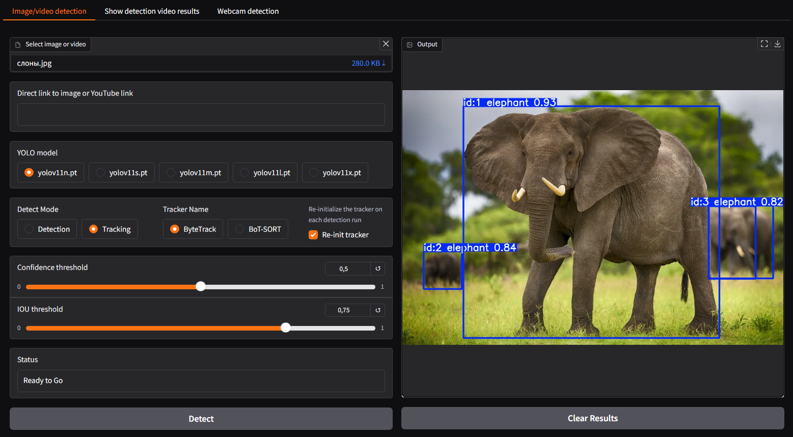
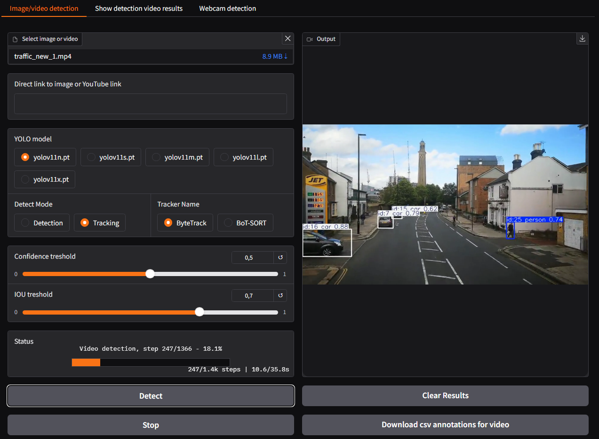
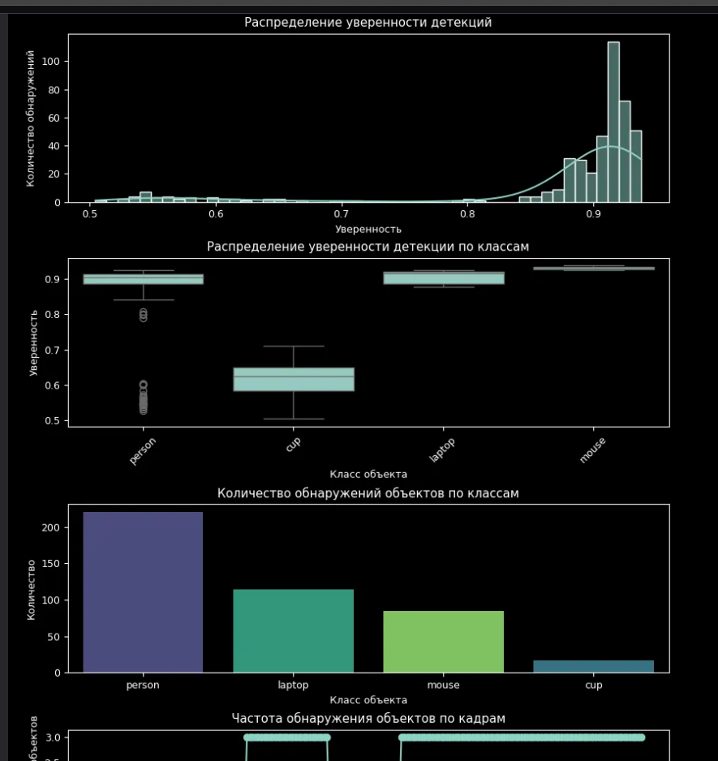

---
# Детектор объектов YOLOv11

<div align="center">


</div>

---
<div align="center">

Детектор объектов на фото и видео на основе модели YOLOv11
</div>

<div align="center">
<a href="https://colab.research.google.com/drive/1Z_Wzuy361n5Xby_NgX6kF1WIHmdkeh6_"></a>
<a href="https://huggingface.co/spaces/sergey21000/yolo-detector"></a>
<a href="https://hub.docker.com/r/sergey21000/yolo-detector"></a>
</div>

В Goole Colab ноутбуке находится код приложения с комментариями, демонстрацией распознавания фото и видео через модели YOLOv11 из библиотеки Ultralytics и анализом результатов детекции видео с помощью графиков

<details>
<summary>Скриншот страницы детекции видео</summary>


</details>

<details>
<summary>Скриншот страницы отображения графиков результатов детекции видео</summary>


</details>

---
## 📋 Содержание

- 🚀 [Функционал](#-Функционал)
- 🛠 [Технологии](#-Технологии)
- 🐍 [Установка и запуск через Python](#-Установка-и-запуск-через-Python)
- 🐳 [Установка и запуск через Docker](#-Установка-и-запуск-через-Docker)
  - 🏗 [Запуск через Docker Compose](#-Запуск-через-Docker-Compose)
  - - 📥 [Запуск Compose из образа Docker HUB](#-Запуск-Compose-из-образа-Docker-HUB)
  - - 🔨 [Запуск Compose со сборкой образа](#-Запуск-Compose-со-сборкой-образа)
  - 🐋 [Запуск через Docker](#-Запуск-через-Docker)
  - - 📥 [Запуск контейнера из образа Docker HUB](#-Запуск-контейнера-из-образа-Docker-HUB)
  - - 🔨 [Сборка образа из Dockerfile и запуск контейнера](#-Сборка-образа-из-Dockerfile-и-запуск-контейнера)


---
# 🚀 Функционал

- Детекция объектов на изображениях (файл или URL ссылка)
- Детекция объектов на видео (файл или ссылка на YouTube) с прогресс баром
- Трекинг объектов на видео
- Детекция/Трекинг объектов с веб-камеры в реальном времени через WebRTC
- Кнопка `Stop` - возможность остановить детекцию видео в любой момент и сохранить текущий прогресс детекции/трекинга
- Настройка параметров детекции - IOU и Confidence, sыбор моделей YOLOv11, выбор трекера
- Сохранение результатов детекций к видео в `csv` файл для дальнейшего анализа
- Отображение графиков результатов детекции видео в приложении


---
# 🛠 Технологии

- [python](https://www.python.org/) >=3.10
- [ultralytics](https://github.com/ultralytics/ultralytics) для детекции объектов с помощью моделей YOLOv11
- [gradio](https://github.com/gradio-app/gradio) для написания веб-интерфейса
- [fastrtc](https://github.com/gradio-app/fastrtc) для захвата видео с веб камеры
- [pandas](https://github.com/pandas-dev/pandas) для формирования датафрейма и его сохранения в формат `csv`
- [yt_dlp](https://github.com/yt-dlp/yt-dlp) для загрузки видео с YouTube

Работоспособность приложения проверялась на Ubuntu 22.04 (python 3.10) и Windows 10 (python 3.12)

---
**Проблемы**  

При деплое на удаленных серверах их IP часто оказываются в черных списках YouTube, поэтому загрузка видео через `yt_dlp` может выдавать ошибку  
[Sign in to confirm you’re not a bot. This helps protect our community #10128](https://github.com/yt-dlp/yt-dlp/issues/10128)


---
# 🐍 Установка и запуск через Python

**1) Клонирование репозитория**  

```sh
git clone https://github.com/sergey21000/yolo-detector.git
cd yolo-detector
```

**2) Создание и активация виртуального окружения (опционально)**

- *Linux*
  ```sh
  python3 -m venv env
  source env/bin/activate
  ```

- *Windows CMD*
  ```sh
  python -m venv env
  env\Scripts\activate
  ```

- *Windows PowerShell*
  ```powershell
  python -m venv env
  env\Scripts\activate.ps1
  ```

**3) Установка зависимостей**  

- *С поддержкой CPU*
  ```sh
  pip install -r requirements.txt --extra-index-url https://download.pytorch.org/whl/cpu
  ```

- *С поддержкой CUDA 12.8*
  ```sh
  pip install -r requirements.txt --extra-index-url https://download.pytorch.org/whl/cu128
  ```

[Страница](https://pytorch.org/get-started/locally/#start-locally) устанвки Pytorch где можно выбрать `--extra-index-url` для других версий CUDA

**4) Запуск сервера Gradio**  

```sh
python3 app.py
```
После запуска сервера перейти в браузере по адресу http://127.0.0.1:7860/  
Приложение доступно через некоторое время после запуска (после первоначальной загрузки моделей)


---
# 🐳 Установка и запуск через Docker

Для запуска приложения с поддержкой GPU CUDA необходима установка [NVIDIA Container Toolkit](https://docs.nvidia.com/datacenter/cloud-native/container-toolkit/latest/install-guide.html#installation).


## 🏗 Запуск через Docker Compose

### 📥 Запуск Compose из образа Docker HUB

**1) Загрузка Compose и установка переменной `COMPOSE_FILE`**

*Загрузка Compose с поддержкой CPU*
```sh
curl -fsSL --remote-name https://raw.githubusercontent.com/sergey21000/yolo-detector/main/compose.base.yml
curl -fsSL --remote-name https://raw.githubusercontent.com/sergey21000/yolo-detector/main/compose.run.cpu.yml
export COMPOSE_FILE=compose.run.cpu.yml
```

*Загрузка Compose с поддержкой CUDA*
```sh
curl -fsSL --remote-name https://raw.githubusercontent.com/sergey21000/yolo-detector/main/compose.base.yml
curl -fsSL --remote-name https://raw.githubusercontent.com/sergey21000/yolo-detector/main/compose.run.cuda.yml
export COMPOSE_FILE=compose.run.cuda.yml
```

**2) Запуск Compose**
```sh
docker compose up -d
```

Веб-интерфейс сервера доступен по адресу  
http://127.0.0.1:7860/  
Приложение доступно через некоторое время после запуска (после первоначальной загрузки моделей)

---
<ins><b>Дополнительно</b></ins>

**Запуск Compose с сервером Nginx**
```sh
curl -fsSL --remote-name https://raw.githubusercontent.com/sergey21000/yolo-detector/main/compose.base.yml
curl -fsSL --remote-name https://raw.githubusercontent.com/sergey21000/yolo-detector/main/compose.run.cpu.yml
curl -fsSL --remote-name https://raw.githubusercontent.com/sergey21000/yolo-detector/main/compose.nginx.yml
mkdir -p nginx
curl -fsSL -o nginx/nginx.conf https://raw.githubusercontent.com/sergey21000/yolo-detector/main/nginx/nginx.conf
export COMPOSE_FILE=compose.run.cpu.yml:compose.nginx.yml
docker compose up -d
```

Веб-интерфейс сервера доступен по адресу  
http://127.0.0.1

**Как загрузить Compose и установить переменную окружения в Windows**

- *PowerShell* (можно вставить сразу весь блок)
```powershell
curl.exe -fsSL --remote-name https://raw.githubusercontent.com/sergey21000/yolo-detector/main/compose.base.yml
curl.exe -fsSL --remote-name https://raw.githubusercontent.com/sergey21000/yolo-detector/main/compose.run.cpu.yml
$env:COMPOSE_FILE = "compose.run.cpu.yml"
echo $env:COMPOSE_FILE

```

- *CMD* (каждую команду выполнять отдельно)
```sh
curl -fsSL --remote-name https://raw.githubusercontent.com/sergey21000/yolo-detector/main/compose.base.yml

curl -fsSL --remote-name https://raw.githubusercontent.com/sergey21000/yolo-detector/main/compose.run.cpu.yml

set COMPOSE_FILE=compose.run.cpu.yml

echo %COMPOSE_FILE%
```

Для перечисления нескольких файлов в переменной `COMPOSE_FILE` в Windows использовать разделитель `;`
```powershell
# установка переменной окружения (вариант для Windows PowerShell)
$env:COMPOSE_FILE = "compose.run.cpu.yml;compose.nginx.yml"
```


### 🔨 Запуск Compose со сборкой образа

**1) Клонирование репозитория**  
```sh
git clone https://github.com/sergey21000/yolo-detector.git
cd yolo-detector/docker
```

**2) Запуск Compose**

*С поддержкой CPU*
```sh
export COMPOSE_FILE=compose.build.cpu.yml
docker compose up -d
```

*С поддержкой CUDA*
```sh
export COMPOSE_FILE=compose.build.cuda.yml
docker compose up -d
```

Или с указанием `compose` файла в одной команде
```sh
docker compose -f compose.build.cuda.yml up -d
```


При первом запуске будет произведена сборка образа на основе `Dockerfile-cpu` или `Dockerfile-cuda`

Веб-интерфейс сервера доступен по адресу  
http://127.0.0.1:7860/  
Приложение доступно через некоторое время после запуска (после первоначальной загрузки моделей)


## 🐋 Запуск через Docker

### 📥 Запуск контейнера из образа Docker HUB

*С поддержкой CPU*
```sh
docker run -d -p 7860:7860 \
	-v ./models:/app/models \
	-v ./runs:/app/runs \
	ghcr.io/sergey21000/yolo-detector:main-cpu
```

*С поддержкой CUDA*
```sh
docker run -d --gpus all -p 7860:7860 \
	-v ./models:/app/models \
	-v ./runs:/app/runs \
	ghcr.io/sergey21000/yolo-detector:main-cuda
```

Веб-интерфейс сервера доступен по адресу  
http://127.0.0.1:7860/  
Приложение доступно через некоторое время после запуска (после первоначальной загрузки моделей)


### 🔨 Сборка образа из Dockerfile и запуск контейнера

**1) Клонирование репозитория**  
```sh
git clone https://github.com/sergey21000/yolo-detector.git
cd yolo-detector
```

**2) Сборка образа и запуск контейнера**

- *С поддержкой CPU*

  Сборка образа
  ```sh
  docker build -t yolo-detector:cpu -f docker/Dockerfile-cpu .
  ```
  Запуск контейнера
  ```sh
  docker run -d -p 7860:7860 \
      -v ./models:/app/models \
      -v ./runs:/app/runs \
      yolo-detector:cpu
  ```

- *С поддержкой CUDA*

  Сборка образа
  ```sh
  docker build -t yolo-detector:cuda -f docker/Dockerfile-cuda .
  ```
  Запуск контейнера
  ```sh
  docker run -d --gpus all -p 7860:7860 \
      -v ./models:/app/models \
      -v ./runs:/app/runs \
      yolo-detector:cuda
  ```

Веб-интерфейс сервера доступен по адресу  
http://127.0.0.1:7860/  
Приложение доступно через некоторое время после запуска (после первоначальной загрузки моделей)

---

Приложение написано для демонстрационных и образовательных целей, оно не предназначалось и не тестировалось для промышленного использования


## Лицензия

Этот проект лицензирован на условиях лицензии [AGPL-3.0 License](./LICENSE).

