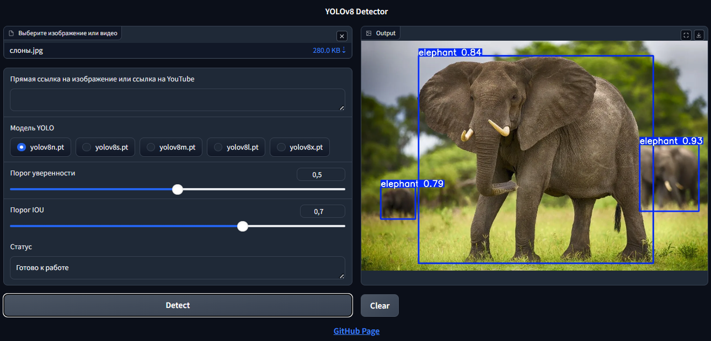

## Детектор объектов на основе YOLOv8


<div align="center">



</div>

Детектор объектов на фото и видео на основе модели YOLOv8


### Ссылки
- [](https://colab.research.google.com/github/sergey21000/yolo-detector/blob/main/YOLO_Gradio_App_Docker.ipynb) Google Colab ноутбук с комментариями, демонстрацией распознавания фото и видео и анализом результатов детекции видео 
- [](https://huggingface.co/spaces/sergey21000/yolo-detector) Gradio Web Demo
- [](https://hub.docker.com/r/sergey21000/yolo-detector) Docker Hub 


### Возможности
- Детекция объектов на изображениях (файл или URL ссылка)
- Детекция видео (файл или ссылка на YouTube)
- Возможность выбора моделей (загружаются в директорию `/models`)  
- Сохранение результатов детекций к видео в `csv` файл для дальнейшего анализа


### Стек:
- [python](https://www.python.org/) >=3.8
- [ultralytics](https://github.com/ultralytics/ultralytics) для детекции объектов с помощью моделей YOLOv8
- [gradio](https://github.com/gradio-app/gradio) для написания веб-интерфейса
- [pandas](https://github.com/pandas-dev/pandas) для формирования датафрейма и его сохранения в формат `csv`


---
## **Установка и запуск через Python**

**1) Клонирование репозитория**  

```bash
git clone https://github.com/username21000/info-bot.git
cd info-bot
```

**2) Установка зависимостей**  

С поддержкой CPU
```bash
pip install -r requirements.txt --extra-index-url https://download.pytorch.org/whl/cpu
```

С поддержкой CUDA 12.4
```bash
pip install -r requirements.txt --extra-index-url https://download.pytorch.org/whl/cu124
```
[Страница](https://pytorch.org/get-started/locally/#start-locally) устанвки Pytorch где можно выбрать `--extra-index-url` для других версий CUDA

**3) Запуск сервера Gradio**  
```bash
python3 app.py
```
После запуска сервера перейти в браузере по адресу http://localhost:7860/  
Приложение доступно через несколько секунд после запуска


---
## **Установка и запуск через Docker**

Для запуска приложения с поддержкой GPU CUDA необходима установка [NVIDIA Container Toolkit](https://docs.nvidia.com/datacenter/cloud-native/container-toolkit/latest/install-guide.html#installation).


### Запуск контейнера из готового образа Docker HUB

*С поддержкой CPU*
```
docker run -d -p 7860:7860 -v ./models:/app/models --name yolo-detector sergey21000/yolo-detector:cpu
```

*С поддержкой CUDA*
```
docker run -d --gpus all -p 7860:7860 -v ./models:/app/models sergey21000/yolo-detector:cuda
```


### Сборка своего образа

**1) Клонирование репозитория**  
```bash
git clone https://github.com/username21000/info-bot.git
cd info-bot
```

**2) Сборка образа и запуск контейнера**

*С поддержкой CPU*

Сборка образа
```
docker build -t yolo-detector:cpu -f Dockerfile-cpu .
```

Запуск контейнера
```
docker run -d -p 7860:7860 -v ./models:/app/models yolo-detector:cpu
```

*С поддержкой CUDA*

Сборка образа
```
docker build -t yolo-detector:cuda -f Dockerfile-cuda .
```

Запуск контейнера
```
docker run -d --gpus all -p 7860:7860 -v ./models:/app/models yolo-detector:cuda
```

После запуска сервера перейти в браузере по адресу http://localhost:7860/  
Приложение доступно через несколько секунд после запуска

---

Приложение тестировалось на python 3.8, 3.10 и следующих версиях бибилотек:  
```
gradio==4.44.0
ultralytics==8.2.98
yt-dlp==2024.8.6
```

Приложение написано для демонстрационных и образовательных целей, оно не предназначалось и не тестировалось для промышленного использования

## Лицензия

Этот проект лицензирован на условиях лицензии AGPL-3.0 License. Подробности в файле [LICENSE](./LICENSE).

