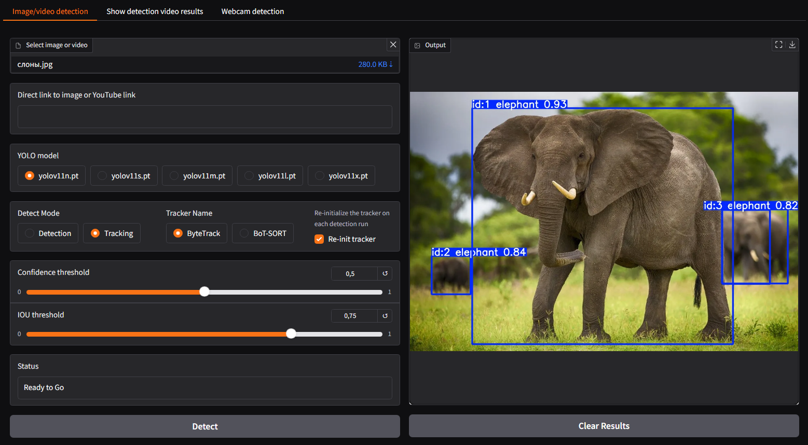
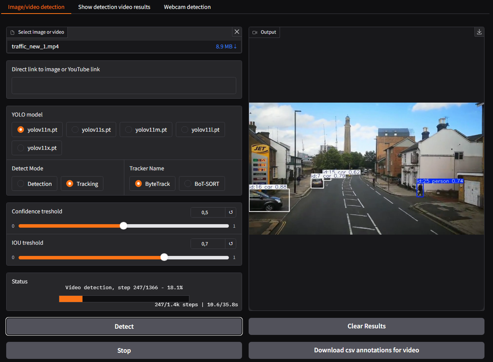
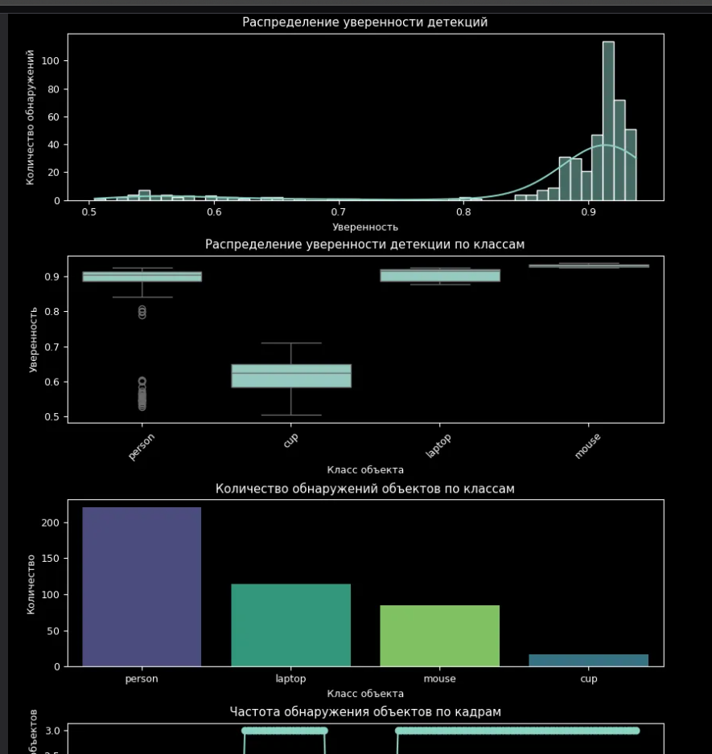

---
# Детектор объектов YOLOv11

<div align="center">


</div>

---
<div align="center">

Детектор объектов на фото и видео на основе модели YOLOv11
</div>

<div align="center">
<a href="https://colab.research.google.com/drive/1Z_Wzuy361n5Xby_NgX6kF1WIHmdkeh6_"></a>
<a href="https://huggingface.co/spaces/sergey21000/yolo-detector"></a>
<a href="https://hub.docker.com/r/sergey21000/yolo-detector"></a>
</div>

В Goole Colab ноутбуке находится код приложения с комментариями, демонстрацией распознавания фото и видео через модели YOLOv11 из библиотеки Ultralytics и анализом результатов детекции видео с помощью графиков

<details>
<summary>Скриншот страницы детекции видео</summary>


</details>

<details>
<summary>Скриншот страницы отображения графиков результатов детекции видео</summary>


</details>


---
## 📋 Содержание

- 🚀 [Функционал](#-Функционал)
- 🛠 [Технологии](#-Технологии)
- 🐍 [Установка и запуск через Python](#-Установка-и-запуск-через-Python)
- 🐳 [Установка и запуск через Docker](#-Установка-и-запуск-через-Docker)
  - 🏗 [Запуск через Docker Compose](#-Запуск-через-Docker-Compose)
  - - 📥 [Запуск Compose из образа Docker HUB](#-Запуск-Compose-из-образа-Docker-HUB)
  - - 🔨 [Запуск Compose со сборкой образа](#-Запуск-Compose-со-сборкой-образа)
  - 🐋 [Запуск через Docker](#-Запуск-через-Docker)
  - - 📥 [Запуск контейнера из образа Docker HUB](#-Запуск-контейнера-из-образа-Docker-HUB)
  - - 🔨 [Сборка образа из Dockerfile и запуск контейнера](#-Сборка-образа-из-Dockerfile-и-запуск-контейнера)
- ☸ [Масштабирование через Kubernetes](#-Масштабирование-через-Kubernetes)
  - [Установка библиотек](#Установка-библиотек)
  - [Подготовка и запуск](#Подготовка-и-запуск)
  - [Мониторинг](#Мониторинг)


---
# 🚀 Функционал

- Детекция объектов на изображениях (файл или URL ссылка)
- Детекция объектов на видео (файл или ссылка на YouTube) с прогресс баром
- Трекинг объектов на видео
- Детекция/Трекинг объектов с веб-камеры в реальном времени через WebRTC
- Два режима стриминга с веб-камеры - WebRTC и встроенный в Gradio (переключается в `config.py` в переменной `WEBCAM_MODE`)
- Кнопка `Stop` - возможность остановить детекцию видео в любой момент и сохранить текущий прогресс детекции/трекинга
- Настройка параметров детекции - IOU и Confidence, sыбор моделей YOLOv11, выбор трекера
- Сохранение результатов детекций к видео в `csv` файл для дальнейшего анализа
- Отображение графиков результатов детекции видео в приложении


---
# 🛠 Технологии

- [python](https://www.python.org/) >=3.10
- [ultralytics](https://github.com/ultralytics/ultralytics) для детекции объектов с помощью моделей YOLOv11
- [gradio](https://github.com/gradio-app/gradio) для написания веб-интерфейса
- [fastrtc](https://github.com/gradio-app/fastrtc) для захвата видео с веб камеры
- [pandas](https://github.com/pandas-dev/pandas) для формирования датафрейма и его сохранения в формат `csv`
- [yt_dlp](https://github.com/yt-dlp/yt-dlp) для загрузки видео с YouTube

Работоспособность приложения проверялась на Ubuntu 22.04 (python 3.10) и Windows 10 (python 3.12)

---
**Проблемы**  

При деплое на удаленных серверах их IP часто оказываются в черных списках YouTube, поэтому загрузка видео через `yt_dlp` может выдавать ошибку  
[Sign in to confirm you’re not a bot. This helps protect our community #10128](https://github.com/yt-dlp/yt-dlp/issues/10128)


---
# 🐍 Установка и запуск через Python

**1) Клонирование репозитория**  

```sh
git clone https://github.com/sergey21000/yolo-detector.git
cd yolo-detector
```

**2) Создание и активация виртуального окружения (опционально)**

- *Linux*
  ```sh
  python3 -m venv env
  source env/bin/activate
  ```

- *Windows CMD*
  ```sh
  python -m venv env
  env\Scripts\activate
  ```

- *Windows PowerShell*
  ```powershell
  python -m venv env
  env\Scripts\activate.ps1
  ```

**3) Установка зависимостей**  

- *С поддержкой CPU*
  ```sh
  pip install -r requirements.txt --extra-index-url https://download.pytorch.org/whl/cpu
  ```

- *С поддержкой CUDA 12.8*
  ```sh
  pip install -r requirements.txt --extra-index-url https://download.pytorch.org/whl/cu128
  ```

Для работы библиотеки `opencv` на Linux необходимо установить библиотеки
```sh
sudo apt update && sudo apt install -y --no-install-recommends libgl1 libglib2.0-0
```

[Страница](https://pytorch.org/get-started/locally/#start-locally) устанвки Pytorch где можно выбрать `--extra-index-url` для других версий CUDA

**4) Запуск сервера Gradio**  

```sh
python3 app.py
```
После запуска сервера перейти в браузере по адресу http://127.0.0.1:7860/  
Приложение доступно через некоторое время после запуска (после первоначальной загрузки моделей)

> [!NOTE]
> При запуске приложения на удаленном сервере веб-камера будет работать только по протоколу HTTPS


---
# 🐳 Установка и запуск через Docker

Для запуска приложения с поддержкой GPU CUDA необходима установка [NVIDIA Container Toolkit](https://docs.nvidia.com/datacenter/cloud-native/container-toolkit/latest/install-guide.html#installation).


## 🏗 Запуск через Docker Compose

### 📥 Запуск Compose из образа Docker HUB

**1) Клонирование репозитория**  
```sh
git clone https://github.com/sergey21000/yolo-detector.git
cd yolo-detector
```

**2) Установка переменной `COMPOSE_FILE`**

<ins><i>Для запуска с поддержкой CPU</i></ins>

- Linux
  ```sh
  export COMPOSE_FILE=docker/compose.run.cpu.yml
  ```
- Windows PowerShell
  ```ps1
  $env:COMPOSE_FILE="docker/compose.run.cpu.yml"
  ```

<ins><i>Для запуска с поддержкой CUDA</i></ins>

- Linux
  ```sh
  export COMPOSE_FILE=docker/compose.run.cuda.yml
  ```
- Windows PowerShell
  ```ps1
  $env:COMPOSE_FILE="docker/compose.run.cuda.yml"
  ```

**3) Запуск Compose**
```sh
docker compose up -d
```

Веб-интерфейс сервера доступен по адресу  
http://127.0.0.1:7860/  
Приложение доступно через некоторое время после запуска (после первоначальной загрузки моделей)

> [!NOTE]
> http://localhost:7860/ не будет работать с веб-камерой при запуске через Docker


---
<ins><b>Дополнительно</b></ins>

**Запуск Compose с сервером Nginx**

- Linux
  ```sh
  export COMPOSE_FILE=docker/compose.run.cpu.yml:docker/compose.nginx.yml
  docker compose up -d
  ```
- Windows PowerShell
  ```ps1
  $env:COMPOSE_FILE="docker/compose.run.cpu.yml;docker/compose.nginx.yml"
  docker compose up -d
  ```

Веб-интерфейс сервера доступен по адресу  
http://127.0.0.1


### 🔨 Запуск Compose со сборкой образа

**1) Клонирование репозитория**  
```sh
git clone https://github.com/sergey21000/yolo-detector.git
cd yolo-detector
```

**2) Запуск Compose**

*С поддержкой CPU*
```sh
export COMPOSE_FILE=docker/compose.build.cpu.yml
docker compose up -d --build
```

*С поддержкой CUDA*
```sh
export COMPOSE_FILE=docker/compose.build.cuda.yml
docker compose up -d --build
```

Или с указанием `compose` файла в одной команде
```sh
docker compose -f docker/compose.build.cuda.yml up -d
```

При первом запуске будет произведена сборка образа на основе `Dockerfile-cpu` или `Dockerfile-cuda`

Веб-интерфейс сервера доступен по адресу  
http://127.0.0.1:7860/  
Приложение доступно через некоторое время после запуска (после первоначальной загрузки моделей)


## 🐋 Запуск через Docker

### 📥 Запуск контейнера из образа Docker HUB

*С поддержкой CPU*
```sh
docker run -it -p 7860:7860 \
	-v ./models:/app/models \
	-v ./runs:/app/runs \
	ghcr.io/sergey21000/yolo-detector:main-cpu
```

*С поддержкой CUDA*
```sh
docker run -it --gpus all -p 7860:7860 \
	-v ./models:/app/models \
	-v ./runs:/app/runs \
	ghcr.io/sergey21000/yolo-detector:main-cuda
```

Веб-интерфейс сервера доступен по адресу  
http://127.0.0.1:7860/  
Приложение доступно через некоторое время после запуска (после первоначальной загрузки моделей)

---
Для проброса конфига добавить
```sh
# загрузка конфига (или создать вручную)
curl -fsSL -O https://raw.githubusercontent.com/sergey21000/yolo-detector/main/config.py

# запуск контейнера с пробросом конфига
docker run -it -p 7860:7860 \
	-v ./models:/app/models \
	-v ./runs:/app/runs \
	-v ./config.py:/app/config.py \
	ghcr.io/sergey21000/yolo-detector:main-cpu
```


### 🔨 Сборка образа из Dockerfile и запуск контейнера

**1) Клонирование репозитория**  
```sh
git clone https://github.com/sergey21000/yolo-detector.git
cd yolo-detector
```

**2) Сборка образа и запуск контейнера**

- *С поддержкой CPU*

  Сборка образа
  ```sh
  docker build -t yolo-detector:cpu -f docker/Dockerfile-cpu .
  ```
  Запуск контейнера
  ```sh
  docker run -d -p 7860:7860 \
      -v ./models:/app/models \
      -v ./runs:/app/runs \
      yolo-detector:cpu
  ```

- *С поддержкой CUDA*

  Сборка образа
  ```sh
  docker build -t yolo-detector:cuda -f docker/Dockerfile-cuda .
  ```
  Запуск контейнера
  ```sh
  docker run -d --gpus all -p 7860:7860 \
      -v ./models:/app/models \
      -v ./runs:/app/runs \
      yolo-detector:cuda
  ```

Веб-интерфейс сервера доступен по адресу  
http://127.0.0.1:7860/  
Приложение доступно через некоторое время после запуска (после первоначальной загрузки моделей)


## ☸ Масштабирование через Kubernetes


### Установка библиотек

**1) Docker + Docker Compose**

Быстрая установка Docker + Docker Compose на Linux
```sh
sudo apt-get update
curl -fsSL https://get.docker.com | sudo sh
sudo systemctl enable --now docker
sudo usermod -aG docker $USER
newgrp docker
```

**2) NVIDIA Container Toolkit (опционально)**

Для работы контейнеров на видеокартах NVIDIA нужно установить NVIDIA Container Toolkit  
https://docs.nvidia.com/datacenter/cloud-native/container-toolkit/latest/install-guide.html

Быстрая установка NVIDIA Container Toolkit на Linux
```sh
sudo apt-get update && sudo apt-get install -y --no-install-recommends curl gnupg2
curl -fsSL https://nvidia.github.io/libnvidia-container/gpgkey | sudo gpg --dearmor -o /usr/share/keyrings/nvidia-container-toolkit-keyring.gpg \
  && curl -s -L https://nvidia.github.io/libnvidia-container/stable/deb/nvidia-container-toolkit.list | \
    sed 's#deb https://#deb [signed-by=/usr/share/keyrings/nvidia-container-toolkit-keyring.gpg] https://#g' | \
    sudo tee /etc/apt/sources.list.d/nvidia-container-toolkit.list
sudo apt-get update
sudo apt-get install -y nvidia-container-toolkit
sudo nvidia-ctk runtime configure --runtime=docker
sudo systemctl restart docker
```

**3) Kubernetes**

Установка Kubernetes на Linux (на примере k3s - облегченная версия)  
https://docs.k3s.io/quick-start
```sh
curl -sfL https://get.k3s.io | sh -
```

> [!NOTE]
> Опционально: сделать чтобы запускать команду kubectl без sudo (работает конкретно для k3s)
> ```sh
> sudo chmod 644 /etc/rancher/k3s/k3s.yaml
> ```

**4) Kompose**

Установка kompose на Linux для автоматического создания конфигов из Docker Compose файлов
(для windows просто скачать exe и добавить в переменные окружения)
https://kubernetes.io/docs/tasks/configure-pod-container/translate-compose-kubernetes/#install-kompose
```sh
curl -L https://github.com/kubernetes/kompose/releases/download/v1.34.0/kompose-linux-amd64 -o kompose
chmod +x kompose
sudo mv ./kompose /usr/local/bin/kompose
```
Если конфиги будут создаваться вручную - установку Kompose можно пропустить


### Подготовка и запуск

Клонирование репозитория
```sh
git clone https://github.com/sergey21000/yolo-detector.git
cd yolo-detector
```

**Вариант 1 - запуск из готовых манифестов**

Применить манифесты
```sh
kubectl apply -f k8s/
```

**Вариант 2 удалить папку k8s и создать манифесты заново через kompose**

Создание манифестов (конфигов) для Kubernetes из Docker Compose файлов
```sh
kompose -f docker/compose.run.cpu.yml convert -o k8s/ --deployment
```

Заменить `ClusterIP`  на `NodePort` в `k8s/gradio-app-service.yaml` и назначить порт 3007
```sh
nano k8s/gradio-app-service.yaml
```
Редактировать чтобы было так
```yaml
spec:
  type: NodePort  # дописать эту строку
  ports:
    - name: "7860"
      port: 7860
      targetPort: 7860
      # дописать эту строку если нужен конкретный порт, 
      # если не нужен то узнать порт через `kubectl get svc yolo-detector`
      nodePort: 30007
  sessionAffinity: ClientIP
  selector:
    io.kompose.service: gradio-app
```

Применить манифесты
```sh
kubectl apply -f k8s/
```

**Проверка результата**

Дождаться статуса Running (выйти - `Ctrl` + `C`)
```sh
kubectl get pods -w
```
Перейти на `IP_сервера:30007`, например http://217.16.17.211:30007/

Масштабирование - например сделать два пода вместо одного
```sh
kubectl scale deployment gradio-app --replicas=2
```
Затем проверить поды
```
kubectl get pods
```


### Мониторинг

Установка Helm - пакетный менеджер для Kubernetes  
https://helm.sh/docs/intro/install
```sh
curl -fsSL -o get_helm.sh https://raw.githubusercontent.com/helm/helm/main/scripts/get-helm-4
chmod 700 get_helm.sh
./get_helm.sh
```

Установка Headlamp
```sh
export KUBECONFIG=/etc/rancher/k3s/k3s.yaml
helm repo add headlamp https://kubernetes-sigs.github.io/headlamp/
helm install my-headlamp headlamp/headlamp --namespace kube-system
```
Здесь в первой команде через export устанавливается новый путь до конфига Kubernetes, поскольку он установлен через k3s

Создание сервисного аккаунта с правами администратора
```sh
kubectl -n kube-system create serviceaccount headlamp-admin
kubectl create clusterrolebinding headlamp-admin --serviceaccount=kube-system:headlamp-admin --clusterrole=cluster-admin
```

Вывести токен для входа в дашборд
```sh
kubectl create token headlamp-admin -n kube-system
```
Затем скопировать токен

Открыть доступ через port-forward и не трогать текущий терминал
```sh
kubectl port-forward -n kube-system service/my-headlamp 8080:80 --address 0.0.0.0
```
Перейти на `IP_сервера:8080`, например https://90.156.214.221:8080 и вставить токен  
(если браузер покажет предупреждение о сертификате — это нормально, нажать Дополнительно - Все равно перейти)  
Например посмотреть нагрузку подов можно во вкладе `Workloads` → `Pods`

Вариант как можно запустить port-forward  в фоне
```sh
nohup kubectl port-forward -n kube-system service/my-headlamp 8080:80 --address 0.0.0.0 &
```


## Лицензия

Этот проект лицензирован на условиях лицензии [AGPL-3.0 License](./LICENSE).
